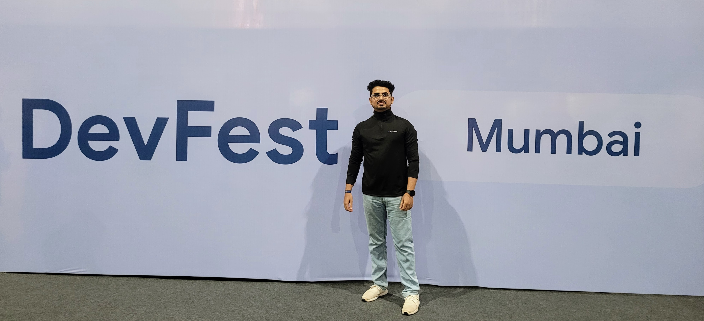

<!-- 🧠 Typing Intro -->

  

    
  

  

    
  

---

<!-- ABOUT ME Section -->

## 💬 About Me

Hi! I’m **Vaibhav** — a DevOps-driven developer who thrives on clean deployments, secure APIs, and scalable infrastructure.
I automate workflows, manage cloud environments, and streamline CI/CD pipelines to keep projects smooth and resilient.

  

---

<!-- TECH STACK Section -->

<h2 align="center">⚙️ Tech Stack</h2>

  
 
 
 
 
 
 
 
 

 
 
  
 
 

---

<!-- GITHUB STATS -->

<h2 align="center">📊 GitHub Stats</h2>

  

---

<h2 align="center">🏆 GitHub Trophies</h2>

  

---

<!-- CONTACTS -->

<h2 style="text-align: center; color: #2c3e50; margin-top: 40px;">🌐 Let's Connect</h2>

  
  
  
  
  

  

---

